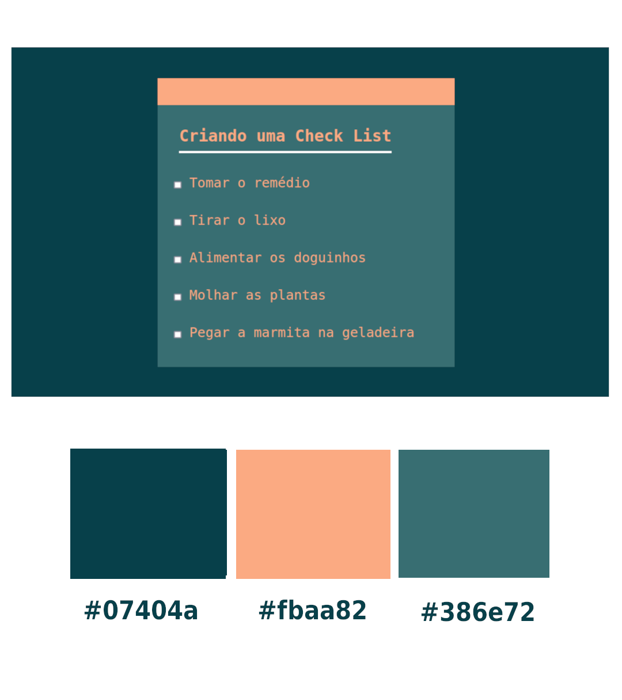

<h1 align="center">Criando uma Check List básica!</h1>

## :clipboard: Sobre o projeto

Um mini projeto em HTML e CSS onde fiz um Check List bem básica e fácil. Esperando ajudar os iniciantes a entender melhor o funcionamento dos códigos dessas linguagens!

---

### :art: Coloquei juntamente com um print da tela a paleta de cores em hexadecimal que utilizei!  

<h1 align="center">

</h1>

## :computer: Tecnologias Usadas 

- HTML
- CSS
